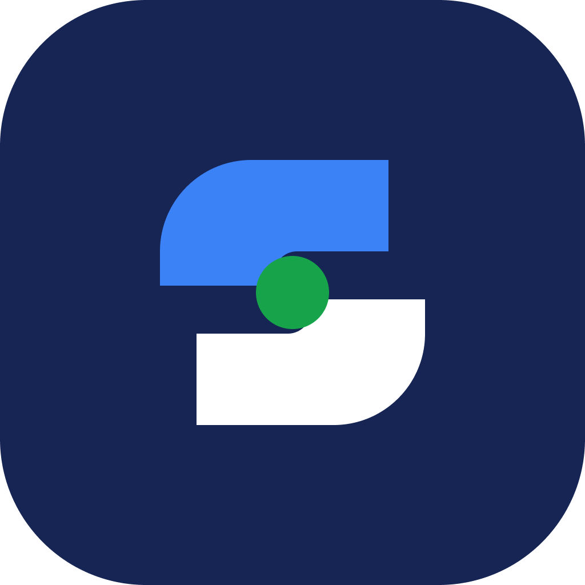
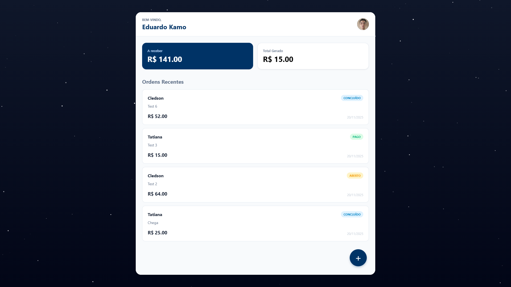
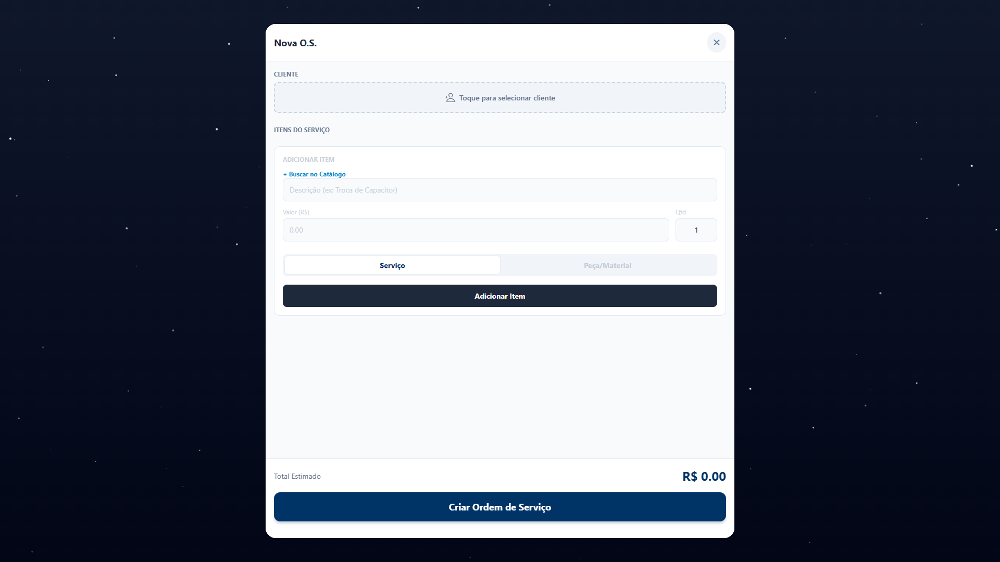
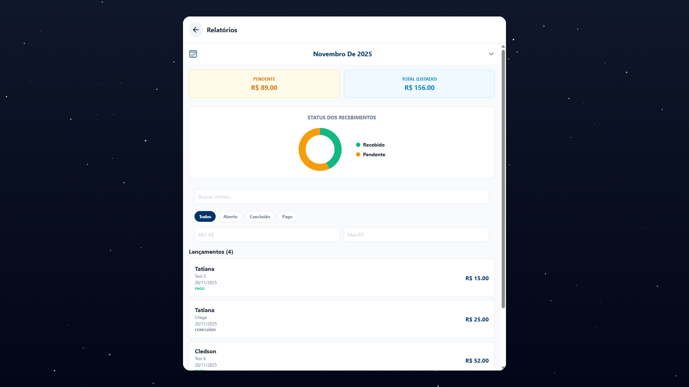
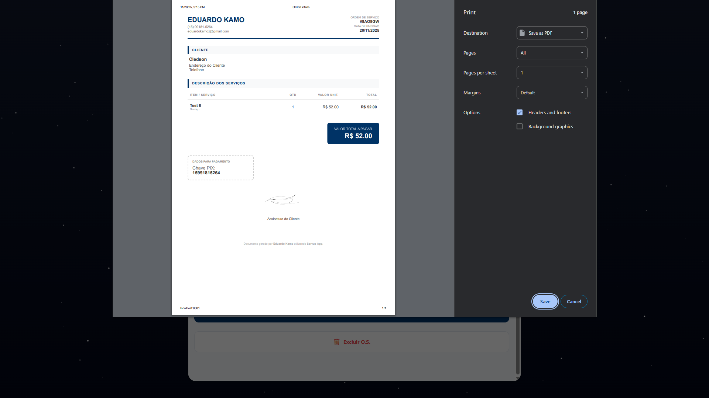
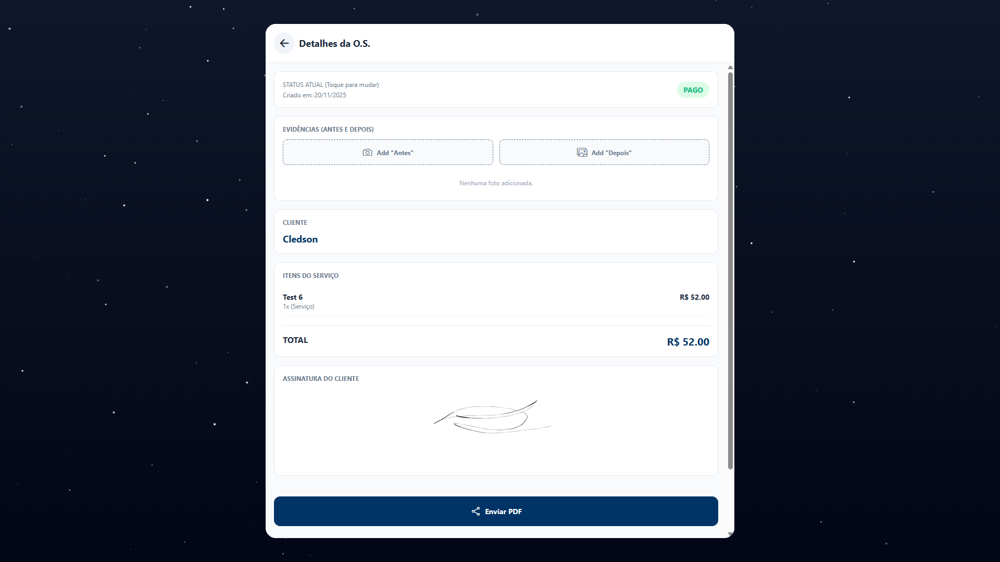

<div align="center">
  
  
  <h1>SERVUS</h1>
  
  <p>
    <strong>O Sistema Operacional do Técnico Moderno.</strong>
  </p>
  
  <p>
    <a href="#-sobre">Sobre</a> •
    <a href="#-funcionalidades">Funcionalidades</a> •
    <a href="#-tecnologias">Tecnologias</a> •
    <a href="#-instalação">Instalação</a> •
    <a href="#-configuração">Configuração</a>
  </p>

  <p>
    
    
    
    
  </p>
</div>

---

## 📱 Sobre o Projeto

**Servus** é uma plataforma completa de gestão (CRM Operacional) desenvolvida para prestadores de serviços técnicos (eletricistas, refrigeração, TI, manutenção).

O objetivo é eliminar o bloco de papel e profissionalizar o atendimento. O aplicativo permite criar Ordens de Serviço, coletar assinaturas digitais, anexar evidências fotográficas e gerar relatórios financeiros, tudo na palma da mão e sincronizado em tempo real.

> **Diferencial:** Funciona perfeitamente no Mobile (Android/iOS) e na Web (Responsivo), permitindo que o técnico use o celular na rua e o computador no escritório.

---

## ✨ Funcionalidades

### 🛠️ Operacional

- **Gestão de O.S.:** Criação rápida de ordens com cálculo automático de valores.
- **Catálogo de Serviços:** Cadastro de preços pré-definidos para agilidade.
- **Assinatura Digital:** Coleta da assinatura do cliente direto na tela do dispositivo.
- **Evidências Fotográficas:** Upload de fotos "Antes e Depois" com compressão automática.
- **Geração de PDF:** Criação de documentos profissionais com Logo e Pix da empresa, prontos para compartilhar no WhatsApp.

### 💰 Financeiro & Gestão

- **Dashboard:** Visão rápida de valores "A Receber" vs "Recebido".
- **Relatórios Avançados:** Gráficos interativos e filtros por data/status.
- **Gestão de Clientes:** Base de dados completa com histórico e contatos.
- **Controle de Status:** Fluxo visual (Aberto -> Concluído -> Pago).

### 🔒 Segurança & SaaS

- **Autenticação Segura:** Login/Cadastro via Email com verificação.
- **Perfil da Empresa:** Personalização de Logo, Telefone e Chave Pix.
- **Modo Escuro:** Interface adaptável (Dark/Light Mode).
- **Lógica de Planos:** Sistema de limites (Free vs Pro) integrado.

---

## 🚀 Acesso & Demo

Você pode testar o funcionamento do projeto agora mesmo através da versão Web ou baixando o APK para Android:

<div align="center">

  <a href="SEU_LINK_DA_WEB_AQUI" target="_blank">
    
  </a>

  <a href="SEU_LINK_DO_APK_AQUI" target="_blank">
    
  </a>

</div>

## 📸 Screenshots

<div align="center">
  <table>
    <tr>
      <td align="center">
        
        <br />
        <strong>Dashboard</strong>
      </td>
      <td align="center">
        
        <br />
        <strong>Nova O.S.</strong>
      </td>
      <td align="center">
        
        <br />
        <strong>Relatórios</strong>
      </td>
    </tr>
    <tr>
      <td align="center">
        
        <br />
        <strong>PDF Profissional</strong>
      </td>
      <td align="center">
        
        <br />
        <strong>Assinatura Digital</strong>
      </td>
      <td align="center">
        
        <br />
        <strong>Adicionar Fotos</strong>
      </td>
    </tr>
  </table>
</div>

---

## 🚀 Tecnologias

O projeto foi desenvolvido utilizando as melhores práticas de mercado:

- **Core:** [React Native](https://reactnative.dev/) + [Expo SDK 50+](https://expo.dev/)
- **Linguagem:** [TypeScript](https://www.typescriptlang.org/)
- **Backend (Serverless):** [Firebase Authentication](https://firebase.google.com/docs/auth) & [Firestore Database](https://firebase.google.com/docs/firestore)
- **Media Storage:** [Cloudinary API](https://cloudinary.com/) (Otimização de imagens on-the-fly)
- **PDF Engine:** `expo-print` + `expo-sharing` (Geração de HTML para PDF)
- **Gráficos:** `react-native-gifted-charts`
- **UI/UX:** Estilização customizada com suporte a Temas e Responsividade Web/Mobile.

---

## 📦 Instalação

Pré-requisitos: Node.js e Git instalados.

1.  **Clone o repositório:**

    ```bash
    git clone [https://github.com/seu-usuario/servus.git](https://github.com/seu-usuario/servus.git)
    cd servus
    ```

2.  **Instale as dependências:**

    ```bash
    npm install
    ```

3.  **Configure as Variáveis de Ambiente:**
    Crie um arquivo `.env` na raiz do projeto seguindo o exemplo abaixo.

4.  **Execute o projeto:**
    ```bash
    npx expo start -c
    ```

---

## ⚙️ Configuração (.env)

Para que o Backend funcione, você precisa configurar seus próprios projetos no Firebase e Cloudinary.

```env
# FIREBASE CONFIGURATION
EXPO_PUBLIC_FIREBASE_API_KEY=sua_api_key
EXPO_PUBLIC_FIREBASE_AUTH_DOMAIN=seu_projeto.firebaseapp.com
EXPO_PUBLIC_FIREBASE_PROJECT_ID=seu_project_id
EXPO_PUBLIC_FIREBASE_STORAGE_BUCKET=seu_projeto.appspot.com
EXPO_PUBLIC_FIREBASE_SENDER_ID=seu_sender_id
EXPO_PUBLIC_FIREBASE_APP_ID=seu_app_id

# CLOUDINARY CONFIGURATION (Imagens)
EXPO_PUBLIC_CLOUDINARY_CLOUD_NAME=seu_cloud_name
EXPO_PUBLIC_CLOUDINARY_UPLOAD_PRESET=seu_preset_unsigned
```

<div align="center"> <p>Desenvolvido por Eduardo Kamo</p> </div>
